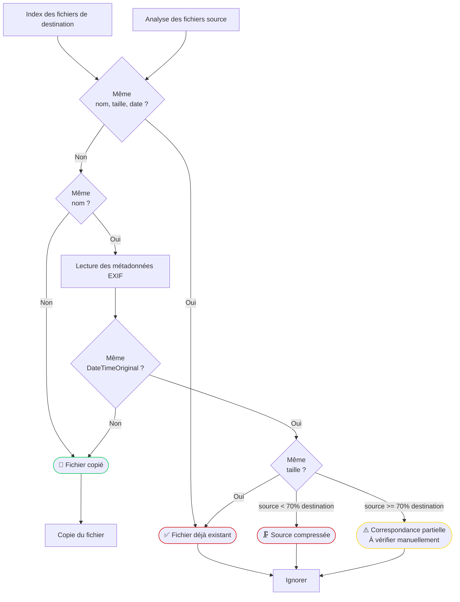

🇬🇧 [English](../README.md) | 🇫🇷**Français**

# Unique Photo Transfer

Unique Photo Transfer est une application de bureau Windows conçue pour **copier des photos et des vidéos vers une bibliothèque existante** tout en évitant les doublons.

Contrairement à une opération de copie traditionnelle, l'application analyse la bibliothèque de destination avant de copier et ne transfère que les fichiers qui ne sont pas déjà présents.

Elle a été conçue pour **des collections très grandes** (des centaines de milliers de fichiers, plusieurs téraoctets) tout en minimisant les accès disque.


# Pourquoi ce projet ?

Copier des photos d'une sauvegarde à une autre semble simple...

Jusqu'à ce que vous ayez :
- plusieurs disques durs externes
- plusieurs sauvegardes de téléphone
- des exportations de Google Photos
- des migrations de NAS
- des dossiers renommés
- des centaines de milliers de fichiers

La plupart des outils de copie soit :
- écrasent les fichiers sans précaution
- dupliquent tout
- ou comparent chaque fichier en utilisant des hachages (ce qui devient extrêmement lent sur des bibliothèques de plusieurs téraoctets), aboutissant à un résultat de comparaison difficile à comprendre, où vous ne savez pas quoi faire si vous voulez simplement copier les fichiers qui ne sont pas déjà là 

Unique Photo Transfer suit une approche différente :  
elle effectue d'abord une **détection rapide basée sur les métadonnées**, et ne effectue les opérations coûteuses que lorsque cela est nécessaire.


# Fonctionnalités

✅ Analyse récursive des dossiers source et de destination  
✅ Prise en charge de plusieurs bibliothèques de destination  
✅ Détection automatique des doublons  
✅ Gestion intelligente des correspondances incertaines  
✅ Comparaison des métadonnées EXIF  
✅ Hachage SHA uniquement lorsqu'il est requis  
✅ Base de données de session SQLite  
✅ Interface graphique (PySide6)  
✅ Rapport d'exécution détaillé


# Algorithme de détection

L'application fonctionne en plusieurs étapes.



## 1. Indexation de la destination

Les dossiers de destination sont analysés une seule fois.

Un index SQLite est créé contenant :
- nom de fichier
- taille
- horodatages
- chemin

Cela évite d'analyser à plusieurs reprises la destination.


## 2. Analyse de la source

Chaque fichier source est comparé à l'index.

Résultats possibles :

### Correspondance exacte
Le fichier existe déjà.
Il est ignoré.

### Aucune correspondance

Le fichier est copié.

### Correspondance partielle

Certaines métadonnées correspondent, mais pas toutes.

Exemples :
- même nom de fichier mais horodatage différent
- même nom de fichier mais taille différente
- différences de fuseau horaire
- exportations de Google Photos
- renumérotation d'iPhone repartant à IMG_0001.JPG

Ces fichiers sont marqués pour une analyse plus approfondie.

## 3. Analyse EXIF

Seules les correspondances partielles sont analysées à l'aide d'ExifTool.

L'application compare les métadonnées EXIF : DateTimeOriginal. Cela résout la plupart des cas incertains sans lire l'ensemble du fichier.
Si un fichier des correspondances partielles du fichier source a le même DateTimeOriginal, la correspondance est considérée comme exacte et le fichier n'est pas copié.


## 4. Vérification par hachage (à implémenter)

Seuls les fichiers ambigus restants sont hachés.
Cela fournit une certitude tout en évitant de hacher l'ensemble de la bibliothèque.


## 5. Vérification utilisateur des fichiers restants, si nécessaire

Après les 4 étapes ci-dessus, tous les fichiers qui ne sont pas déjà dans la bibliothèque de destination avec certitude ont été copiés. Les autres fichiers ont été identifiés comme étant déjà présents, ou à analyser manuellement.
Chaque fichier source a un statut, qui peut être :

| Statut                | Description                                                                                                                                                                                               |
| --------------------- | --------------------------------------------------------------------------------------------------------------------------------------------------------------------------------------------------------- |
| 📄 Copié            | Aucun fichier correspondant dans la bibliothèque de destination &rarr; le fichier a été copié                                                                                                                          |
| 🗜️ Source compressée | Fichier correspondant dans la bibliothèque de destination, mais avec une taille plus grande &rarr; le fichier n'a pas été copié                                                                                                  |
| ✅ Fichier déjà existant    | Fichier correspondant dans la bibliothèque de destination &rarr; le fichier n'a pas été copié                                                                                                                          |
| ⚠️ Correspondance partielle     | Il existe un ou plusieurs fichiers qui pourraient correspondre au fichier source dans la bibliothèque de destination. Toujours incertain après l'analyse par lots &rarr; le fichier n'a pas été copié, nécessite une vérification manuelle |


# Performances

L'application est conçue pour minimiser les accès disque.

Au lieu de hacher chaque fichier, elle :
- analyse les répertoires une seule fois
- crée un index SQLite
- compare les métadonnées en premier
- hache uniquement les fichiers ambigus

Cela la rend adaptée aux bibliothèques contenant plusieurs téraoctets de données.


# Interface utilisateur

L'application fournit :
- sélection du dossier source
- plusieurs dossiers de destination
- copie de destination facultative
- barres de progression
- statistiques détaillées
- navigateur de résultats
- inspection des correspondances partielles


# Technologies

- Python
- PySide6
- SQLite
- ExifTool
- GitHub Actions
- PyInstaller


# Construction manuelle

Cloner le référentiel :

```
git clone https://github.com/FunkyKwak/unique-photo-transfer.git
```

Installer les dépendances :

```
pip install -r requirements.txt
```

Exécuter :

```
python main.py
```

---

# Versions - Exécutable autonome

Les exécutables Windows autonomes sont générés automatiquement via GitHub Actions.

Aucune installation de Python n'est requise.

Dernière version :

https://github.com/FunkyKwak/unique-photo-transfer/releases


# Feuille de route

- [x]  Indexation rapide des métadonnées
- [x]  Base de données de session SQLite
- [x]  Détection de correspondance partielle
- [x]  Comparaison EXIF
- [ ]  Vérification basée sur les hachages
- [ ]  Arrêt du processus sans crash 
- [ ]  Fenêtre de comparaison côte à côte
- [ ]  Réouverture de l'analyse précédente
- [ ]  Fichier de configuration
- [ ]  Internationalisation


# Contribution

Les rapports de bogue, les idées et les demandes de tirage sont les bienvenus.