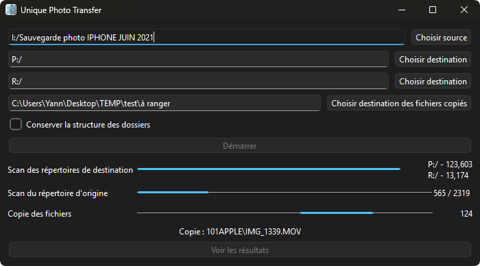
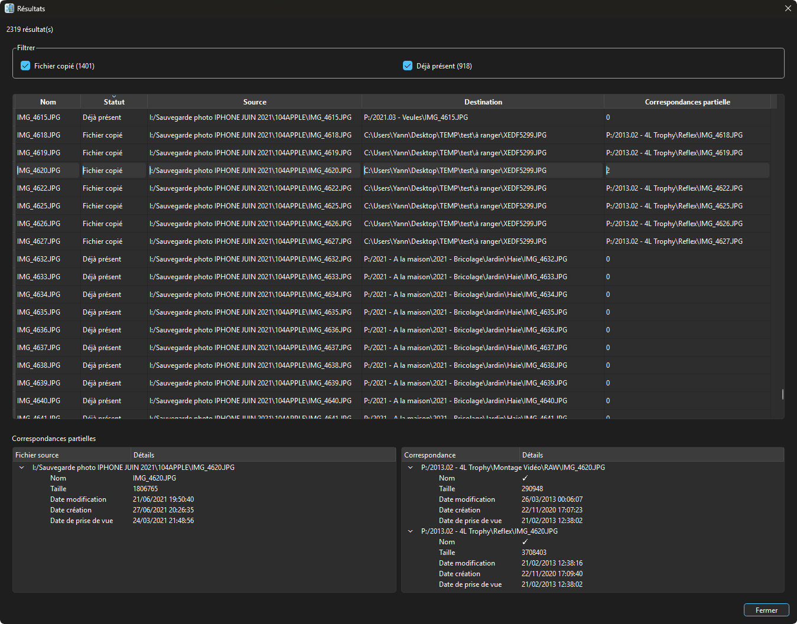
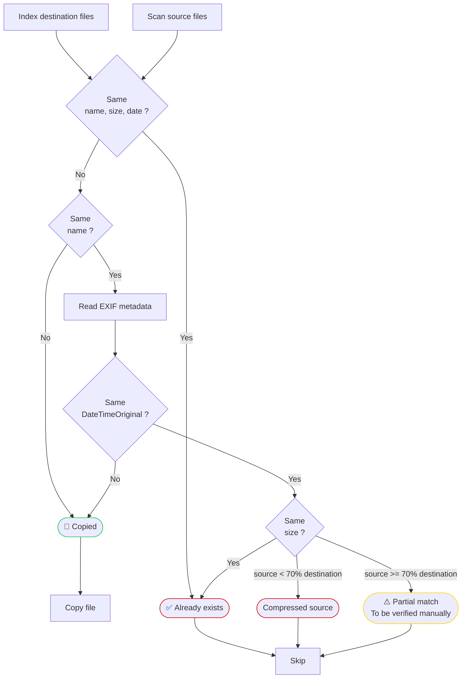

# Unique Photo Transfer

Unique Photo Transfer is a Windows desktop application designed to **copy photo and video to an existing library** while avoiding duplicates.

Unlike a traditional copy operation, the application analyzes the destination library before copying and only transfers files that are not already present.

It has been designed for **very large collections** (hundreds of thousands of files, several terabytes) while keeping disk accesses to a minimum.





# Why this project?

Copying photos from one backup to another sounds simple...

Until you have:
- several external hard drives
- multiple phone backups
- Google Photos exports
- NAS migrations
- renamed folders
- hundreds of thousands of files

Most copy tools either:
- blindly overwrite files
- duplicate everything
- or compare every file using hashes (which becomes extremely slow on multi-terabyte libraries), ending with a compare result hard to understand, where you don't know what to do if you just want to copy the files not already there 

Unique Photo Transfer follows a different approach:  
it performs **fast metadata-based detection first**, and only performs expensive operations when necessary.


# Features

✅ Recursive scan of source and destination folders  
✅ Support for multiple destination libraries  
✅ Automatic duplicate detection  
✅ Smart handling of uncertain matches  
✅ EXIF metadata comparison  
✅ SHA hashing only when required  
✅ SQLite session database  
✅ Graphical interface (PySide6)  
✅ Detailed execution report


# Detection algorithm

The application works in several stages.



## 1. Destination indexing

The destination folders are scanned only once.

An SQLite index is created containing:
- filename
- size
- timestamps
- path

This avoids repeatedly scanning the destination.


## 2. Source analysis

Each source file is compared against the index.

Possible outcomes:

### Exact match
The file already exists.
It is skipped.

### No match

The file is copied.

### Partial match

Some metadata match, but not all.

Examples:
- same filename but different timestamp
- same filename but different size
- timezone differences
- Google Photos exports
- iPhone numbering restarting at IMG_0001.JPG

These files are marked for deeper analysis.

## 3. EXIF analysis

Only partial matches are analyzed using ExifTool.

The application compares EXIF:DateTimeOriginal metadata. This resolves most uncertain cases without reading the entire file.
If one file from the partial matches of the source file has the same DateTimeOriginal, the match is considered exact and the file is noot copied.


## 4. Hash verification (to be implemented)

Only the remaining ambiguous files are hashed.
This provides certainty while avoiding hashing the entire library.


## 5. User checks only the remaining, if any

After the 4 steps above, all files that are not already in the destination library for sure have been copied. The other files have been identifieds either already there, or to be anaylized manually.
Each source file has a status, which can be :

| Status            | Description                                                                                                                                                                                            |
| ----------------- | ------------------------------------------------------------------------------------------------------------------------------------------------------------------------------------------------------ |
| Copied            | No corresponding file in the destination library &rarr; the file has been copied                                                                                                                       |
| Already exists    | Corresponding file in the destination library &rarr; the file hasn't been copied                                                                                                                       |
| Compressed source | Corresponding file in the destination library, but with a bigger size &rarr; the file hasn't been copied                                                                                               |
| Partial match     | There is one or several files that could correspond to the source file in the destination library. Still not sure after the batch analysis &rarr; the file hasn't been copied, requires user verification |


# Performance

The application is designed to minimise disk I/O.

Instead of hashing every file, it:
- scans directories once
- builds an SQLite index
- compares metadata first
- hashes only ambiguous files

This makes it suitable for libraries containing several terabytes of data.


# User interface

The application provides:
- source folder selection
- multiple destination folders
- optional copy destination
- progress bars
- detailed statistics
- result browser
- partial match inspection


# Technologies

- Python
- PySide6
- SQLite
- ExifTool
- GitHub Actions
- PyInstaller


# Building manually

Clone the repository:

```
git clone https://github.com/FunkyKwak/unique-photo-transfer.git
```

Install dependencies:

```
pip install -r requirements.txt
```

Run:

```
python main.py
```

---

# Releases - Standalone executable

Standalone Windows executables are automatically generated through GitHub Actions.

No Python installation is required.

Latest release:

https://github.com/FunkyKwak/unique-photo-transfer/releases


# Roadmap

- [x]  Fast metadata indexing
- [x]  SQLite session database
- [x]  Partial match detection
- [x]  EXIF comparison
- [ ]  Hash-based verification
- [ ]  Stop process without crashing 
- [ ]  Side-by-side comparison window
- [ ]  Reopen previous analysis
- [ ]  Configuration file
- [ ]  Internationalization


# Contributing

Bug reports, ideas and pull requests are welcome.
